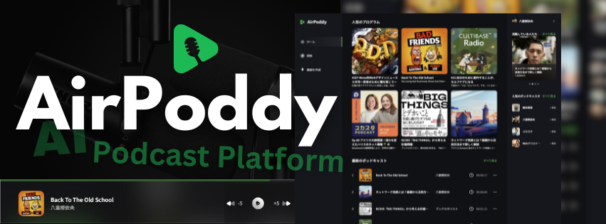

<div align="center">
  <div>
    
    
    
    
    
    
    
    
    
    
    
    
    
  </div>

  <h3 align="center">AI Podcast Distribution Platform</h3>

  <div align="center">
    AI で音声とサムネイルを生成できるポッドキャスト配信プラットフォーム
  </div>
</div>

## 📋 <a name="table">Table of Contents</a>

1. 🤖 [はじめに](#intro)
2. 🔗 [URL](#url)
3. 🔋 [アプリの機能](#feature)
4. 🚀 [アプリの利用サンプル](#example)
5. 🤸 [終わりに](#outro)

## <a name="intro">🤖 はじめに</a>

プロンプトから文章を入力して音声を生成。
プロンプトから文章を入力してサムネイルを生成。生成した音声をそのままポッドキャストとして配信できるプラットフォーム、AirPoddy を紹介します。

## <a name="url">🔗 URL</a>

AirPoddy | AI Podcast Distribution Platform  
https://airpoddy.vercel.app

## <a name="feature">🔋 アプリの機能</a>

### 🔐 ユーザ認証システム

メールアドレス、または Google アカウントによるユーザログインと登録システム

### 🎧 固定ポッドキャストプレイヤー

画面下部にポッドキャストプレイヤーが表示され継続的にポッドキャストを聞くことが可能

### 🔍 検索ページ

新しいポッドキャストや人気のポッドキャストを探せるページ

### 🎙️ ポッドキャストの作成ページ

テキストからオーディオへの変換、AI画像生成、プレビューを備えたポッドキャスト作成をサポート

### 👄 マルチボイスAI機能

ポッドキャスト作成のための複数のAI生成ボイスからポッドキャストの作成が可能

### 👤 プロフィールページ

ポッドキャスト配信者のプロフィール、番組一覧を表示し、ランダムに番組を再生することも可能

### 📻 番組詳細ページ

開催日時、詳細を含む、過去に開催されたミーティングのリストを表示

### 🔊 ポッドキャストプレイヤー

ミュート/ミュート解除機能だけでなく、バックワード/フォワードコントロールを備えたプレイヤー

### 📐 レスポンシブデザイン

あらゆるデバイスや画面サイズに対応し、機能的かつ視覚的にすぐれたデザイン

## <a name="screen_list">💻 画面一覧</a>

```
AirPoddy  
　│     
　├─　ログイン関連  
　│　　　　サインインページ  
　│　　　　アカウントページ登録ページ  
　│  
　├─　共通部  
　│　　　　左サイドバー  
　│　　　　右サイドバー  
　│　　　　モバイルメニュー  
　│  
　├─　ホームページ  
　│  
　├─　検索ページ  
　│  
　├─　番組作成ページ  
　│  
　├─　番組詳細ページ  
　│  
　└─　プロフィールページ  
```

### ログイン関連

```
ログイン関連  
　　サインインページ  
　　アカウント登録ページ     
```

#### サインインページ

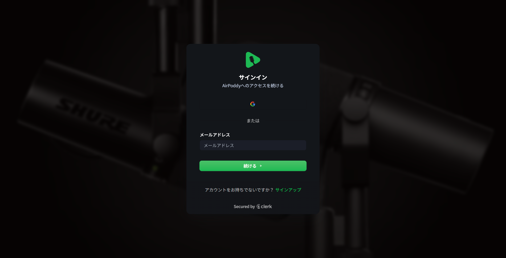

#### アカウント作成ページ

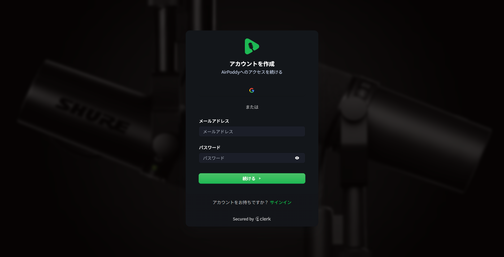

### 共通部

```
共通部  
　　左サイドバー  
　　右サイドバー  
    モバイルメニュー  
``` 

##### 左サイドバー  

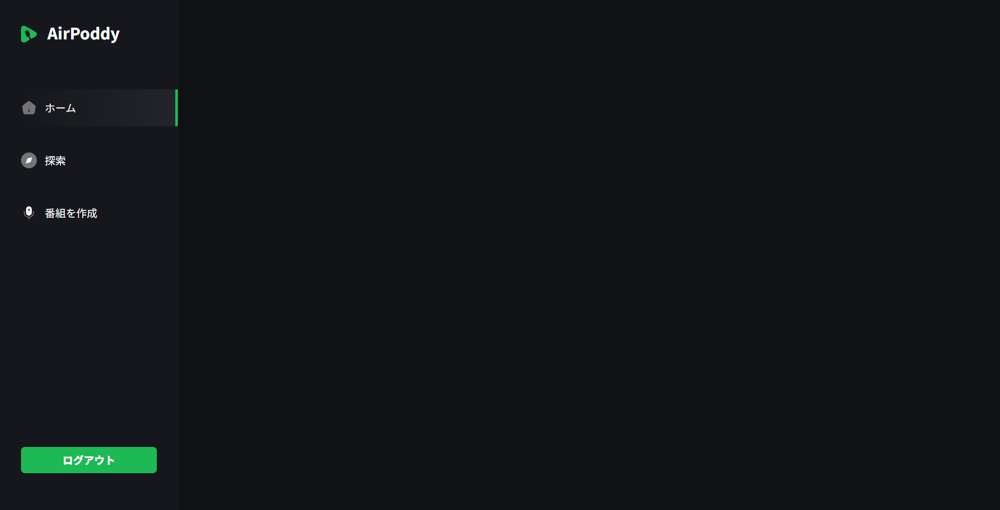

##### 右サイドバー  

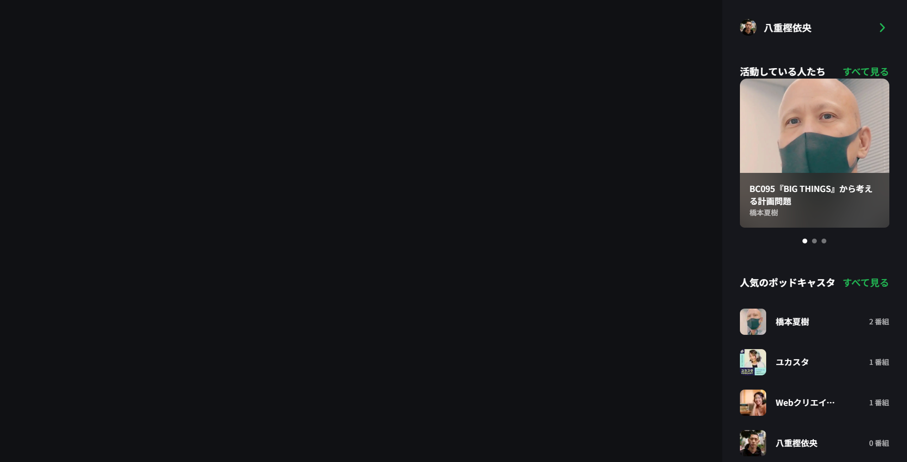

##### モバイルメニュー  


### 各ページ

##### ホームページ  

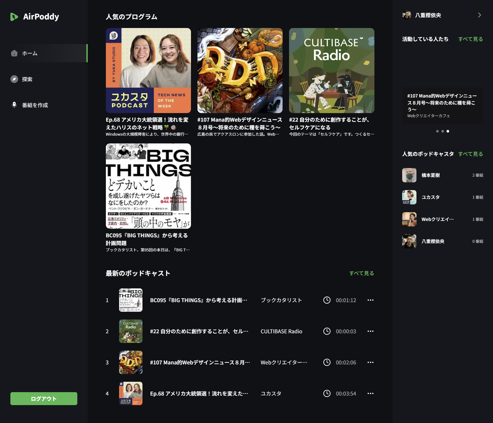

#### 検索ページ  

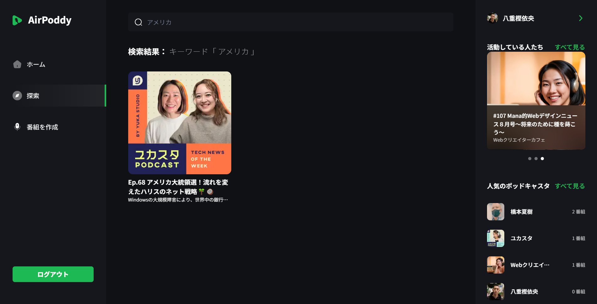

#### 番組作成ページ  

##### AIによるサムネイル生成をする場合

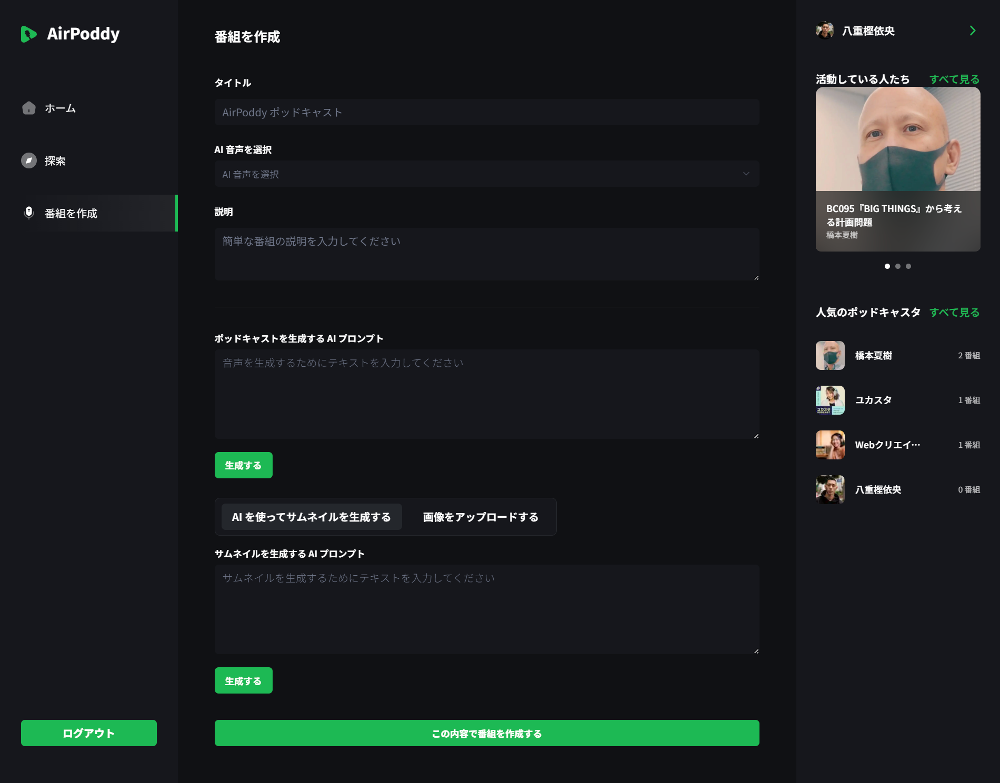

##### 画像アップロードでサムネイルを登録する場合

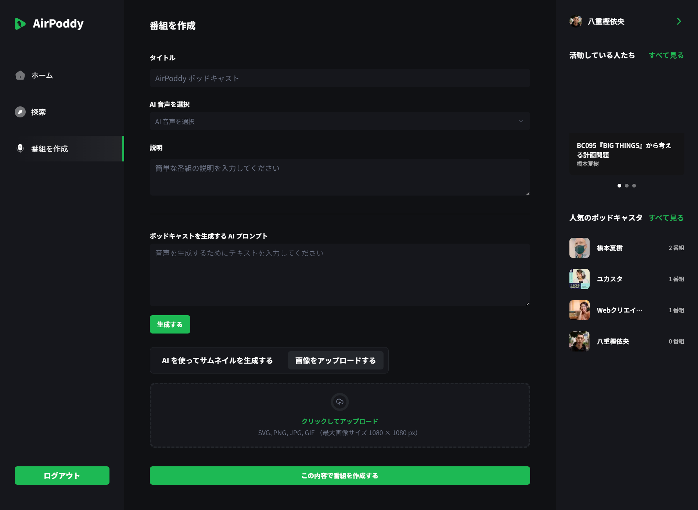

#### 番組詳細ページ  


#### プロフィールページ  

##### まだ番組を作成していないユーザのプロフィール

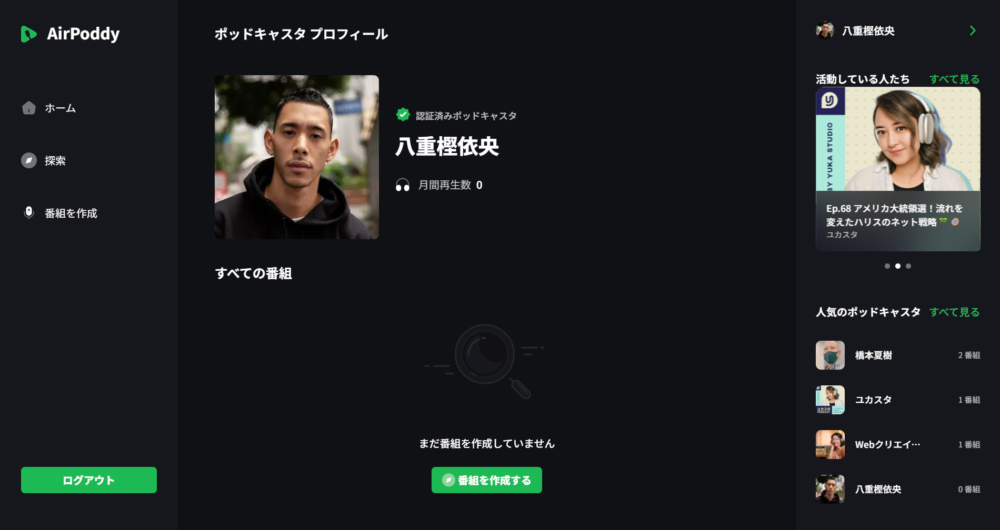

##### すでにいくつか番組を作成しているユーザのプロフィール

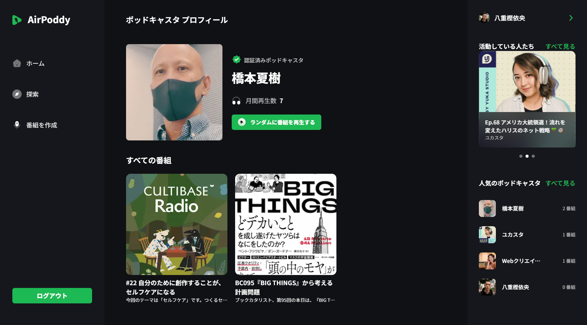

## <a name="outro">🤸 おわりに</a>

トーク番組的なポッドキャストを配信するアプリは数多くあります。AI で音声やサムネイルを自動生成することの強みを生かせば、そのような一般的なアプリとの差別化を図ることも可能です。

例えば、学んだことを学習記録としてポッドキャスト化して学習記録として残していけば、多くの人と知識の共有ができる場になるはずです。

実際に動画を撮ったり、音声を録音する手間が掛からないため、ナレッジをストック、配信するハードルは格段に低く、コンテンツの作成の効率化、スピードアップも見込めます。
